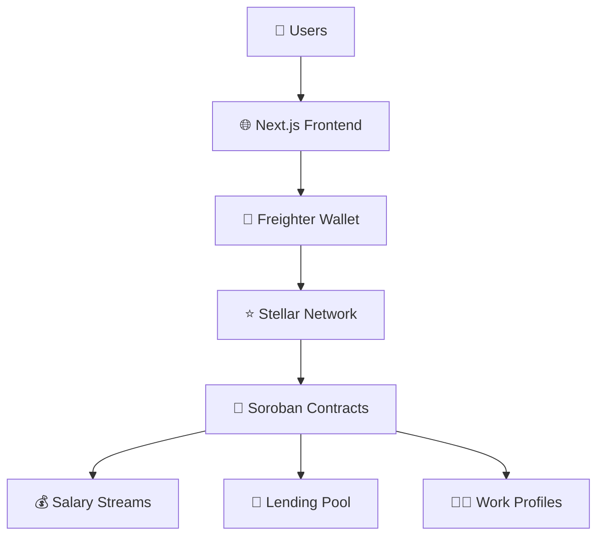

# � PayStream - Real-Time Salary Streaming & DeFi Lending Platform

<div align="center">


**Stream salaries in real-time, unlock instant liquidity with stream-backed loans**

[](https://stellar.org)
[](https://soroban.stellar.org)
[](https://nextjs.org)
[](https://typescriptlang.org)

[🚀 Live Demo](#-live-demo) • [📖 Documentation](#-documentation) • [🏗️ Architecture](#-technical-architecture) • [🤝 Contributing](#-contributing)

</div>

---

## 🌟 Overview

PayStream revolutionizes traditional payroll and lending systems by enabling **real-time salary streaming** and **collateralized lending** on the Stellar blockchain. Built with Soroban smart contracts, it provides transparency, efficiency, and instant liquidity for the modern workforce.

### ✨ Key Features

- � **Real-Time Salary Streaming** - Continuous payment flows instead of monthly payrolls
- 🏦 **Stream-Backed Lending** - Use active salary streams as loan collateral
- 📊 **Risk-Based Rates** - 5-tier risk assessment (4.0% - 6.0% APR)
- 👥 **Multi-Role Platform** - Employer, employee, and admin dashboards
- 🔒 **Decentralized & Transparent** - Built on Stellar blockchain
- ⚡ **Instant Liquidity** - Access earned wages anytime

---

## 🚀 Live Demo

**🌐 Frontend**: [https://paystream.vercel.app](https://paystream.vercel.app)

**🔗 Smart Contracts on Stellar Testnet**:

- **Salary Streaming**: `CAACXYESJLBLSO6YI4Q4PBTQGLUOLDWVRBU6OEP3WHSHCQ7ASPZ66J34`
- **Lending Platform**: `CCEM6DMMVFLPJHZIDN5TM3SPQPZKYPBMXE4HN3HFRZILF3MJQ4I76VUR`
- **Work Profiles**: `CCAHTMF7PDOB2KM4SIDDHBW2AMVGEWCTLKG3BSYJNTFGMASSGMKO6OKT`

### 🎯 Demo Accounts

For testing purposes, use these Stellar testnet addresses:

| Role         | Address                                                    | Purpose                        |
| ------------ | ---------------------------------------------------------- | ------------------------------ |
| **Admin**    | `GALDPLQ62RAX3V7RJE73D3C2F4SKHGCJ3MIYJ4MLU2EAIUXBDSUVS7SA` | Create streams, manage loans   |
| **Employee** | Your Freighter wallet                                      | Receive streams, request loans |

---

## 🏗️ Technical Architecture

### 📋 Tech Stack

**Frontend**

- ⚛️ **Next.js 15.3.3** - React framework with App Router
- 🎨 **Tailwind CSS 4.0** - Modern utility-first styling
- 🔗 **Freighter API 4.1.0** - Stellar wallet integration
- 📦 **TypeScript 5** - Type-safe development
- 🎯 **Lucide React** - Beautiful icons

**Blockchain**

- 🌟 **Stellar Blockchain** - Fast, low-cost transactions
- 🦀 **Soroban (Rust)** - Smart contract platform
- 💎 **XLM (Lumens)** - Native cryptocurrency
- 🧪 **Testnet Environment** - Safe development environment

**Smart Contracts**

```rust
// Workspace structure
contracts/
├── salary-streaming/    # Real-time payment streams
├── lending/            # Collateralized lending
└── work-profile/       # Employee risk assessment
```

### 🔧 System Architecture



---

## 🚀 Getting Started

### 📋 Prerequisites

- **Node.js 18+** and **npm/yarn**
- **Rust** and **Cargo** (for smart contracts)
- **Stellar CLI** (for contract deployment)
- **Freighter Wallet** browser extension

### 🛠️ Installation

1. **Clone the repository**

```bash
git clone https://github.com/murat48/PayStrm.git
cd PayStrm
```

2. **Install frontend dependencies**

```bash
cd frontend
npm install
```

3. **Configure environment variables**

```bash
cp .env.example .env.local
```

Edit `.env.local`:

```env
NEXT_PUBLIC_STELLAR_NETWORK_PASSPHRASE="Test SDF Network ; September 2015"
NEXT_PUBLIC_STELLAR_RPC_URL="https://soroban-testnet.stellar.org"
NEXT_PUBLIC_LENDING_CONTRACT_ID="your_lending_contract_id"
NEXT_PUBLIC_SALARY_STREAMING_CONTRACT_ID="your_streaming_contract_id"
NEXT_PUBLIC_WORK_PROFILE_CONTRACT_ID="your_profile_contract_id"
```

4. **Run the development server**

```bash
npm run dev
```

Visit `http://localhost:3000` 🎉

### 📦 Smart Contract Setup

1. **Build contracts**

```bash
cd contracts
cargo build --target wasm32-unknown-unknown --release
```

2. **Deploy to Stellar Testnet**

```bash
stellar contract deploy \
  --wasm target/wasm32v1-none/release/salary_streaming.wasm \
  --source YOUR_SECRET_KEY \
  --network testnet
```

---

## 📱 Usage Guide

### 👨‍� For Employers

1. **🔗 Connect Wallet** - Link your Freighter wallet
2. **➕ Create Streams** - Set up salary streams for employees
3. **⏸️ Manage Streams** - Pause, resume, or end active streams
4. **📊 Monitor Usage** - Track employee withdrawals and stream status

### 👨‍💻 For Employees

1. **💼 Receive Streams** - Get real-time salary payments
2. **💸 Withdraw Anytime** - Access earned wages instantly
3. **📋 Request Loans** - Use active streams as collateral
4. **📈 Build Profile** - Improve risk score for better rates

### 🏦 For Administrators

1. **🔍 Review Loans** - Evaluate loan applications
2. **✅ Approve/Reject** - Make lending decisions
3. **📊 Monitor Portfolio** - Track loan performance
4. **⚖️ Risk Management** - Adjust risk parameters

---

## 💰 Economic Model

### 🎯 Risk Tiers & Interest Rates

| Risk Tier     | Interest Rate (APR) | Target Profile                           |
| ------------- | ------------------- | ---------------------------------------- |
| 🟢 **Tier 1** | 4.0%                | Senior professionals, stable employment  |
| 🔵 **Tier 2** | 4.5%                | Mid-level employees, good track record   |
| 🟡 **Tier 3** | 5.0%                | Standard risk profile                    |
| 🟠 **Tier 4** | 5.5%                | Junior level, shorter employment history |
| 🔴 **Tier 5** | 6.0%                | High risk, new to workforce              |

### 📊 Risk Assessment Factors

- 📅 **Employment Duration** - Length of current position
- 💼 **Job Stability** - Frequency of job changes
- 🏭 **Industry Sector** - Economic stability of sector
- 💰 **Stream Value** - Size and consistency of payments
- 📈 **Payment History** - Track record of on-time payments

---

## 🔧 Smart Contract API

### 💸 Salary Streaming Functions

```rust
// Create a new salary stream
pub fn create_stream(
    employer: Address,
    employee: Address,
    total_amount: i128,
    rate_per_second: i128,
    duration_seconds: u64
) -> u32

// Withdraw available funds
pub fn withdraw(stream_id: u32, amount: i128) -> Result<(), Error>

// Pause stream (employer only)
pub fn pause_stream(stream_id: u32) -> Result<(), Error>

// Resume paused stream
pub fn resume_stream(stream_id: u32) -> Result<(), Error>
```

### 🏦 Lending Functions

```rust
// Request a new loan
pub fn request_loan(
    amount: i128,
    risk_tier: u32,
    collateral_stream_id: u32
) -> u32

// Approve loan (admin only)
pub fn approve_loan(loan_id: u32) -> Result<(), Error>

// Repay loan
pub fn repay_loan(loan_id: u32, amount: i128) -> Result<(), Error>
```

### 👤 Work Profile Functions

```rust
// Create user profile
pub fn create_profile(
    experience_years: u32,
    sector: String,
    job_changes: u32
) -> Result<(), Error>

// Calculate risk tier
pub fn calculate_risk_tier(user: Address) -> u32

// Update employment info
pub fn update_profile(
    experience_years: u32,
    sector: String
) -> Result<(), Error>
```

---

## 🛣️ Roadmap

### 🎯 Phase 1: Core Platform (✅ Completed)

- [x] Real-time salary streaming
- [x] Basic lending functionality
- [x] Freighter wallet integration
- [x] Admin dashboard

### 🚀 Phase 2: Enhanced Features (🔄 In Progress)

- [ ] Multi-token support (USDC, EURC)
- [ ] Mobile-responsive design improvements
- [ ] Advanced risk models
- [ ] Automated liquidation

### 🌟 Phase 3: Advanced DeFi (📋 Planned)

- [ ] Yield farming for lenders
- [ ] Cross-chain compatibility
- [ ] NFT work certificates
- [ ] DAO governance

### 🌍 Phase 4: Mainnet & Scale (🔮 Future)

- [ ] Stellar mainnet deployment
- [ ] Enterprise partnerships
- [ ] Global compliance
- [ ] Institutional features

---

## 🤝 Contributing

We welcome contributions! Please see our [Contributing Guide](CONTRIBUTING.md) for details.

### 🔧 Development Workflow

1. Fork the repository
2. Create a feature branch
3. Make your changes
4. Add tests and documentation
5. Submit a pull request

### 🐛 Bug Reports

Found a bug? Please [open an issue](https://github.com/murat48/PayStrm/issues) with:

- Clear description
- Steps to reproduce
- Expected vs actual behavior
- Screenshots if applicable

---

## 📄 License

This project is licensed under the **MIT License** - see the [LICENSE](LICENSE) file for details.

## 📂 Project Structure

### 🏗️ Frontend Architecture

```
frontend/
├── src/
│   ├── app/                    # Next.js 15 App Router
│   │   ├── layout.tsx         # Root layout with Tailwind CSS
│   │   ├── page.tsx           # Landing page with wallet connection
│   │   └── dashboard/         # Dashboard pages
│   │       └── page.tsx       # Main dashboard with tabs
│   ├── components/            # React components
│   │   ├── dashboard/         # Dashboard-specific components
│   │   │   └── Dashboard.tsx  # Main dashboard component
│   │   ├── stream/           # Streaming functionality
│   │   │   └── StreamSections.tsx # Stream management
│   │   ├── lending/          # Lending platform
│   │   │   └── LendingSection.tsx # Loan management
│   │   ├── layout/           # Layout components
│   │   │   ├── ModernCard.tsx
│   │   │   └── ModernHeader.tsx
│   │   └── wallet/           # Wallet integration
│   ├── lib/                  # Core libraries
│   │   ├── stellar-working.ts # Soroban smart contract integration
│   │   └── contracts.ts      # Contract addresses and configuration
│   └── types/                # TypeScript definitions
├── public/                   # Static assets (SVG icons, images)
└── package.json             # Dependencies and scripts
```

### 🦀 Smart Contracts Structure

```
contracts/
├── Cargo.toml              # Workspace configuration
├── salary-streaming/       # Real-time payment streams
│   ├── Cargo.toml
│   └── src/
│       ├── lib.rs         # Stream creation, withdrawal, management
│       └── test.rs        # Contract tests
├── lending/               # Collateralized lending platform
│   ├── Cargo.toml
│   └── src/
│       ├── lib.rs         # Loan requests, approval, repayment
│       └── test.rs        # Lending tests
└── work-profile/          # Employee risk assessment
    ├── Cargo.toml
    └── src/
        ├── lib.rs         # Profile management, risk scoring
        └── test.rs        # Profile tests
```

---

## 🔧 Development & Deployment

### 📋 Prerequisites

- **Node.js 18+** and **npm** for frontend development
- **Rust 1.70+** and **Cargo** for smart contract development
- **Stellar CLI** for contract deployment and testing
- **Freighter Wallet** browser extension for transaction signing

### 🛠️ Local Development Setup

1. **Clone and setup**

```bash
git clone https://github.com/murat48/PayStrm.git
cd PayStrm/frontend
npm install
```

2. **Configure environment**

```bash
cp .env.example .env.local
```

Edit `.env.local` with current contract addresses:

```env
NEXT_PUBLIC_STELLAR_NETWORK_PASSPHRASE="Test SDF Network ; September 2015"
NEXT_PUBLIC_STELLAR_RPC_URL="https://soroban-testnet.stellar.org"
NEXT_PUBLIC_SALARY_STREAMING_CONTRACT_ID="CCTSOF3ALAAZHTS3FYLXM6Y7J3EEVVPQMUDCYKOPRDVFIFNWRZXNNYS3"
NEXT_PUBLIC_LENDING_CONTRACT_ID="CCZLYFUU2F4PWDEXQ4TD2K4LXFY7N2ACMC7V6XXVLIDKSWXWB56E537C"
NEXT_PUBLIC_WORK_PROFILE_CONTRACT_ID="CCAHTMF7PDOB2KM4SIDDHBW2AMVGEWCTLKG3BSYJNTFGMASSGMKO6OKT"
```

3. **Start development server**

```bash
npm run dev
```

### 🚀 Smart Contract Development

1. **Build contracts**

```bash
cd contracts
cargo build --target wasm32-unknown-unknown --release
```

2. **Run tests**

```bash
cargo test
```

3. **Deploy to testnet**

```bash
stellar contract deploy \
  --wasm target/wasm32v1-none/release/salary_streaming.wasm \
  --source-account YOUR_SECRET_KEY \
  --network testnet
```

---

## 🔒 Security & Best Practices

### 🛡️ Smart Contract Security

- **Input Validation**: All parameters validated before processing
- **Access Control**: Role-based permissions (admin, employer, employee)
- **Overflow Protection**: Safe arithmetic operations throughout
- **State Consistency**: Atomic state updates prevent race conditions
- **Emergency Controls**: Admin can pause contracts if needed

### 🔐 Frontend Security

- **Wallet Integration**: Uses official Freighter API for secure signing
- **Network Validation**: All transactions verified before submission
- **Error Handling**: Comprehensive error messages and fallbacks
- **Type Safety**: Full TypeScript coverage for compile-time safety

### ✅ Testing Strategy

```bash
# Smart contract unit tests
cd contracts/salary-streaming && cargo test
cd contracts/lending && cargo test
cd contracts/work-profile && cargo test

# Frontend component tests
cd frontend && npm test

# Integration tests with Stellar testnet
npm run test:integration
```

---

## 📊 Advanced Features

### 🎯 Risk Assessment Engine

The platform includes a sophisticated risk assessment system:

```rust
// Risk calculation factors
pub struct RiskFactors {
    pub employment_duration: u32,    // Months in current job
    pub job_stability: u32,          // Number of job changes
    pub industry_sector: String,     // Economic sector classification
    pub stream_consistency: f64,     // Payment regularity score
    pub total_earnings: u128,        // Historical earnings
}

// Dynamic risk tier calculation
pub fn calculate_dynamic_risk_tier(factors: RiskFactors) -> u32 {
    // Algorithm considers multiple factors for fair assessment
}
```

### 💡 Smart Collateral Management

- **Real-time Monitoring**: Continuous assessment of collateral value
- **Liquidation Protection**: Automatic warnings before liquidation
- **Flexible Terms**: Adjustable loan-to-value ratios based on risk
- **Multi-stream Collateral**: Use multiple streams as combined collateral

### 📈 Analytics & Reporting

- **Stream Performance**: Real-time earnings and withdrawal analytics
- **Loan Portfolio**: Comprehensive loan performance tracking
- **Risk Metrics**: Detailed risk assessment and scoring
- **User Insights**: Employment and payment pattern analysis

---

## 🚀 Production Deployment

### 🌐 Vercel Deployment (Frontend)

```bash
# Build for production
npm run build

# Deploy to Vercel
vercel --prod
```

### ⭐ Stellar Mainnet Deployment (Contracts)

```bash
# Deploy to mainnet (use with caution)
stellar contract deploy \
  --wasm target/wasm32v1-none/release/salary_streaming.wasm \
  --source-account MAINNET_SECRET_KEY \
  --network mainnet
```

### 📋 Production Checklist

- [ ] All tests passing
- [ ] Security audit completed
- [ ] Environment variables configured
- [ ] Contract addresses updated
- [ ] Monitoring and alerting setup
- [ ] Backup and recovery procedures
- [ ] Performance optimization completed

---

## 🙏 Acknowledgments

- **Stellar Development Foundation** - Amazing blockchain platform
- **Soroban Team** - Powerful smart contract framework
- **Freighter Team** - Excellent wallet infrastructure
- **Next.js Team** - Outstanding React framework
- **Open Source Community** - Continuous inspiration and tools

---

## 📞 Contact & Support

### 🌐 Links

- **GitHub**: [https://github.com/murat48/PayStrm](https://github.com/murat48/PayStrm)
- **Live Demo**: [https://paystream.vercel.app](https://paystream.vercel.app)
- **Documentation**: In this README

### 👥 Team

- **Lead Developer**: [@murat48](https://github.com/murat48)
- **Blockchain Architecture**: Stellar & Soroban specialist
- **Frontend Development**: Modern React & Next.js

### 🐛 Issues & Support

- **Bug Reports**: [GitHub Issues](https://github.com/murat48/PayStrm/issues)
- **Feature Requests**: Create detailed GitHub issues
- **Security Issues**: Report privately via email

---

<div align="center">

**🌟 Built with ❤️ on Stellar Blockchain 🌟**

[](https://stellar.org)
[](https://soroban.stellar.org)

**⭐ Star this repo if you find it useful! ⭐**

</div>
