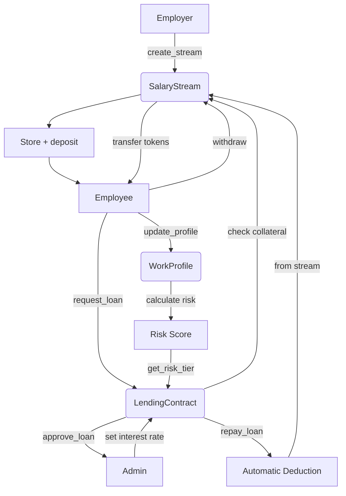

# 🤩 Product Design Requirements (PDR) - PayStream Projesi

## 🌟 Temel Bilgiler

- **Proje Adı:** PayStream - Gerçek Zamanlı Maaş Akış ve Lending Sistemi
- **Tür:** Web3 DeFi / Payroll Streaming / Risk Bazlı Lending
- **Platform:** Stellar Soroban
- **Hedef:** Çalışanlar için gerçek zamanlı maaş ödemeleri ve bu maaşları teminat göstererek kredi alma sistemi

## ✨ Proje Özeti

PayStream, geleneksel bordro süreçlerini blockchain teknolojisiyle yenileyen bir Soroban akıllı kontrat sistemidir. Maaşlar, saniye bazlı akar şekilde çalışanlara ödenir. Çalışanlar, kazandıkları kadarını anlık çekebilir veya maaş akışlarını teminat göstererek kredi kullanabilir. Ayrıca kredi skoruna dayalı risk bazlı faiz sistemine sahiptir.

## 📊 Problem Tanımı

**Mevcut Problemler:**
- Geleneksel bordro sistemleri ayda bir ödeme yapısı
- Manuel hesaplama süreçleri ve hataya açık işlemler
- Sınırlı şeffaflık ve takip edilebilirlik
- Anlık finansal ihtiyaçlara cevap verememe
- Yüksek işlem maliyetleri ve bürokratik süreçler

**PayStream Çözümü:**
- Sürekli maaş akışı (saniye bazlı)
- Otomatik geri ödeme sistemi
- Risk bazlı borç verme algoritması
- Şeffaf ve takip edilebilir ödemeler
- Düşük maliyetli blockchain tabanlı işlemler

## ✅ Yapılacaklar

### 🔐 Smart Contract Geliştirme (Soroban)

#### SalaryStream Kontratı
**Ana Fonksiyonlar:**
- `create_stream(employee, salary_per_second, duration)` - Maaş akışı oluşturma
- `withdraw(amount)` - Kazanılan maaşı çekme
- `deposit(amount)` - İşveren tarafından ek yatırım
- `end_stream(stream_id)` - Akışı sonlandırma
- `pause_stream(stream_id)` - Akışı duraklama
- `resume_stream(stream_id)` - Akışı devam ettirme

**Yardımcı Fonksiyonlar:**
- `get_available_balance(employee)` - Çekilebilir bakiye hesaplama (timestamp bazlı)
- `get_employee_streams(employee)` - Çalışana ait stream listesi
- `get_employer_streams(employer)` - İşverene ait stream listesi
- `emergency_withdraw(stream_id)` - Acil durum çekme (admin)

**Güvenlik Özellikleri:**
- Reentrancy guard implementasyonu
- Timestamp manipülasyonu koruması
- Access control ve yetkilendirme

#### Lending Kontratı
**Ana Fonksiyonlar:**
- `request_loan(amount, collateral_stream_id)` - Kredi talebi
- `approve_loan(loan_id, interest_rate)` - Kredi onayı (admin)
- `repay_loan(loan_id, amount)` - Kredi geri ödemesi
- `liquidate_loan(loan_id)` - Kredinin tasfiyesi

**Yardımcı Fonksiyonlar:**
- `get_outstanding_loans(borrower)` - Aktif krediler listesi
- `calculate_max_loan(stream_id)` - Maksimum kredi tutarı hesaplama
- `get_loan_details(loan_id)` - Kredi detayları

#### WorkProfile Kontratı
**Ana Fonksiyonlar:**
- `update_profile(experience, education, previous_employers)` - Profil güncelleme
- `calculate_risk_score(employee)` - Risk skoru hesaplama
- `get_risk_tier(employee)` - Risk seviyesi belirleme

**Risk Skorlama Kriterleri:**
- İş deneyimi süresi (0-10 puan)
- Eğitim seviyesi (0-5 puan)
- Önceki işveren sayısı (0-3 puan)
- Maaş akış geçmişi (0-7 puan)
- **Toplam:** 25 puan üzerinden

**Risk Seviyeleri:**
- **A Seviye (20-25 puan):** %5-8 faiz oranı
- **B Seviye (15-19 puan):** %8-12 faiz oranı
- **C Seviye (10-14 puan):** %12-18 faiz oranı
- **D Seviye (0-9 puan):** %18-25 faiz oranı

### 💻 Frontend Geliştirme (Next.js + Tailwind)

#### Sayfa Yapısı
**1. Index Sayfası (`/`)**
- Freighter wallet bağlantı ekranı
- Proje tanıtımı ve özellikler
- "Connect Wallet" butonu
- Wallet durumu göstergesi

**2. Ana Sayfa (`/dashboard`)**
- **Maaş Stream Bölümü:**
  - Stream oluşturma formu (işveren için)
  - Aktif stream listesi ve detayları
  - Gerçek zamanlı bakiye göstergesi
  - Geri sayım timer'ı
  - Withdraw/Deposit/End/Pause/Resume butonları

- **Kredi Bölümü:**
  - Kredi talep formu
  - Aktif krediler listesi
  - Geri ödeme ekranı
  - Kredi geçmişi

- **Profil Bölümü:**
  - Profil güncelleme formu
  - Risk tier göstergesi
  - İstatistikler ve analizler

#### Komponent Yapısı
```
components/
├── Layout/
│   ├── Header.tsx
│   ├── Footer.tsx
│   └── Sidebar.tsx
├── Wallet/
│   ├── WalletConnect.tsx
│   └── WalletStatus.tsx
├── Stream/
│   ├── CreateStream.tsx
│   ├── StreamList.tsx
│   ├── StreamCard.tsx
│   └── StreamActions.tsx
├── Lending/
│   ├── LoanRequest.tsx
│   ├── LoanList.tsx
│   └── RepayLoan.tsx
└── Profile/
    ├── ProfileForm.tsx
    ├── RiskTier.tsx
    └── ProfileStats.tsx
```

### 🔗 Wallet Bağlantısı

**Freighter Wallet Entegrasyonu:**
- Kullanıcı public key alma
- Transaction imzalama ve gönderme
- Wallet bağlantı durumunu takip etme
- Network değiştirme (Testnet/Mainnet)
- Balance kontrolü ve gösterimi

**Güvenlik Önlemleri:**
- Transaction confirmation ekranları
- Gas fee tahminleri
- Error handling ve kullanıcı bilgilendirme

## ❌ Yapılmayacaklar

### Contract Seviyesinde
- ❌ NFT entegrasyonu ve koleksiyon özellikleri
- ❌ DAO governance ve multi-signature yapılar
- ❌ Layer 2 çözümleri ve cross-chain köprüler
- ❌ Oracle entegrasyonları (fiyat feed'leri)
- ❌ Flash loan mekanizmaları

### Frontend Seviyesinde
- ❌ Server-Side Rendering (SSR) optimizasyonları
- ❌ Native mobil uygulama geliştirme
- ❌ Kapsamlı admin paneli ve yönetim araçları
- ❌ Çoklu dil desteği (internationalization)
- ❌ Advanced charting ve analytics araçları

## 🛠 Teknik Spesifikasyonlar

| Katman | Teknoloji | Açıklama |
|--------|-----------|----------|
| **Smart Contract** | Soroban SDK (Rust) | Stellar blockchain üzerinde akıllı kontrat geliştirme |
| **Blockchain** | Stellar Testnet | Test ve geliştirme ortamı |
| **Frontend** | Next.js 14, Tailwind CSS, TypeScript | Modern React framework ve utility-first CSS |
| **Wallet** | Freighter Wallet | Stellar ekosistemi için resmi wallet |
| **Token** | Soroban Token Contract | SAC (Stellar Asset Contract) uyumlu token |
| **State Management** | React Context/Zustand | Client-side durum yönetimi |
| **API Integration** | Soroban RPC | Blockchain ile iletişim |

### Performans Gereksinimleri
- **Transaction Latency:** < 5 saniye
- **UI Response Time:** < 2 saniye
- **Stream Update Frequency:** Her 10 saniye
- **Concurrent Users:** 100+ kullanıcı desteği

## 🔮 Test Senaryoları

| Test Başlığı | Durum | Açıklama |
|--------------|-------|----------|
| Salary stream başarıyla oluşturulabiliyor | ✅ | İşveren stream oluşturma süreci |
| Withdraw/deposit fonksiyonları çalışıyor | ✅ | Para çekme ve yatırma işlemleri |
| Stream durdurulup tekrar başlatılabiliyor | ✅ | Pause/resume functionality |
| Stream sonlandırılınca kalan bakiye iade ediliyor | ✅ | End stream ve refund süreci |
| Kullanıcıya ait stream'ler listelenebiliyor | ✅ | Stream listesi ve filtreleme |
| Kredi talebi ve onayı senaryoları başarılı | ✅ | Lending workflow testi |
| Risk tier hesaplaması doğru çalışıyor | ✅ | Risk skorlama algoritması |
| Reentrancy saldırıları engelleniyor | ✅ | Güvenlik testi |
| Timestamp manipülasyonu korunuyor | ✅ | Zaman tabanlı saldırı koruması |
| Emergency withdraw yetkili kişiler tarafından kullanılabiliyor | ✅ | Acil durum senaryosu |

### Test Kategorileri
**Unit Tests:**
- Smart contract fonksiyon testleri
- Frontend komponent testleri
- Utility fonksiyon testleri

**Integration Tests:**
- Wallet bağlantı testleri
- Contract-frontend entegrasyon testleri
- End-to-end user workflow testleri

**Security Tests:**
- Reentrancy saldırı testleri
- Access control testleri
- Edge case senaryoları

## 🔄 Akış Diyagramı



## 📱 Cursor/Copilot Kodlama Aşamaları

### Aşama 1: Proje Kurulumu (1-2 gün)
- **Next.js + Tailwind kurulumu**
  - Project scaffolding
  - Dependencies installation
  - Basic configuration
- **Wallet Setup (Freighter)**
  - Freighter SDK entegrasyonu
  - Connection utilities
  - Account management


### Aşama 2: Frontend Entegrasyonu (4-6 gün)
- **Soroban JS ile fonksiyon çağrıları**
  - Contract interaction layer
  - Transaction handling
  - Error management
- **Wallet Login Implementation**
  - Authentication flow
  - Session management
  - Security measures
- **Arayüz Geliştirme:**
  - Stream management interface
  - Lending dashboard
  - Profile management system

### Aşama 3: Test ve Hata Giderme (2-3 gün)
- **Örnek senaryolar üzerinden test**
  - Happy path testing
  - Edge case validation
  - Performance testing
- **Console log ve UI debugging**
  - Error tracking
  - User feedback systems
  - Performance monitoring

## 🌟 Başarı Kriterleri

### Teknik Kriterler
- **Contract Fonksiyonelliği:** %100 test coverage
- **Güvenlik:** Reentrancy ve timestamp bazlı hesaplama doğruluğu
- **Frontend Entegrasyonu:** Sorunsuz wallet ve contract etkileşimi
- **Performance:** < 5 saniye transaction süresi
- **Stability:** %99.9 uptime

### Kullanıcı Deneyimi Kriterleri
- **Maaş Streaming:** Çalışanlar maaşlarını akış halinde görüp anlık çekebilir
- **Lending System:** Maaşı teminat göstererek kolay kredi alabilir
- **Risk Management:** Profil verisine göre dinamik kredi skoru ve faiz oranları
- **User Interface:** Sezgisel ve kullanıcı dostu arayüz
- **Documentation:** Kapsamlı kullanım kılavuzu ve API dokümantasyonu

### Business Kriterleri
- **User Adoption:** İlk ay içinde 50+ aktif kullanıcı
- **Transaction Volume:** Günlük 100+ transaction
- **System Reliability:** Kritik hata sayısı < 1%
- **User Satisfaction:** 4.5+ rating (5 üzerinden)

## 📋 Risk Yönetimi

### Teknik Riskler
- **Smart Contract Vulnerabilities:** Extensive security testing ve audit
- **Blockchain Network Issues:** Fallback mechanisms ve error handling
- **Wallet Integration Problems:** Multiple wallet support consideration

### Business Riskler
- **Regulatory Compliance:** Legal requirements araştırması
- **Market Competition:** Unique value proposition odaklı development
- **User Adoption:** Comprehensive marketing ve user education

### Mitigation Strategies
- Regular security audits
- Continuous monitoring
- Community feedback integration
- Agile development approach